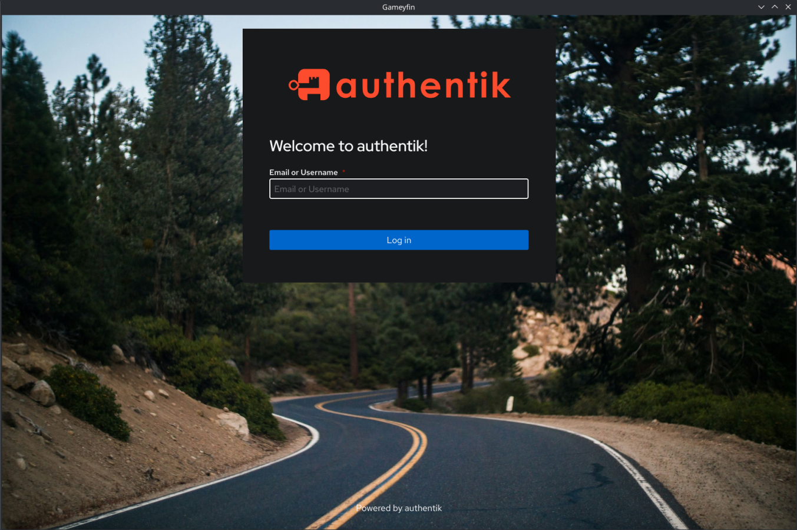
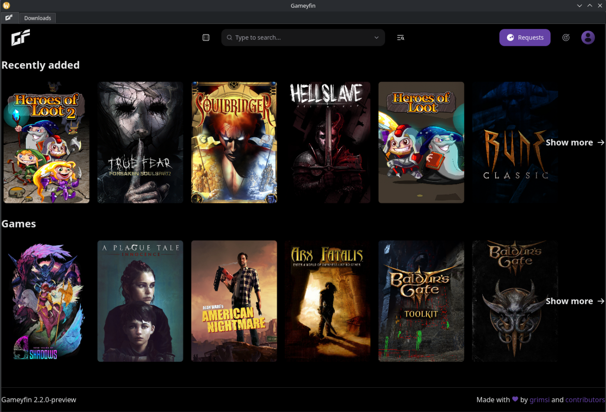
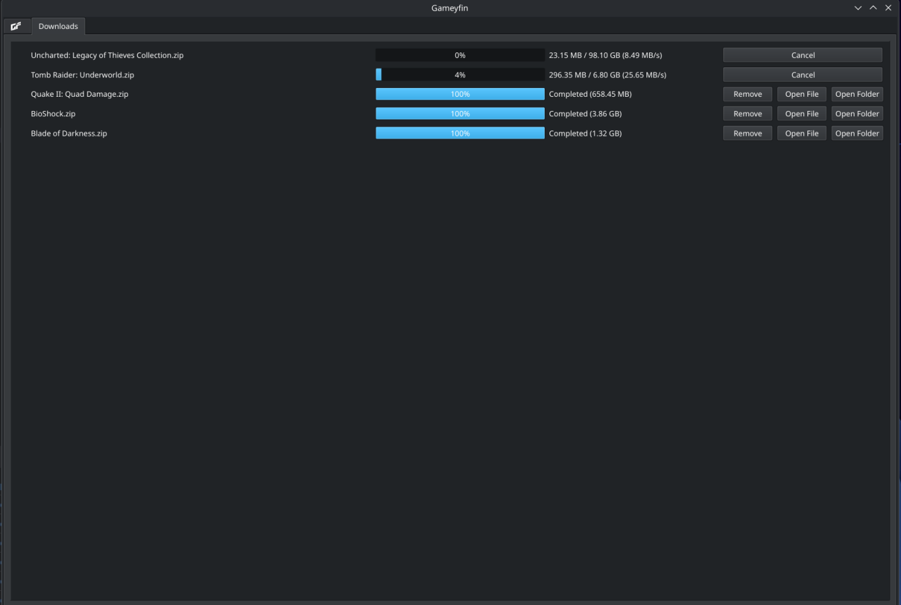
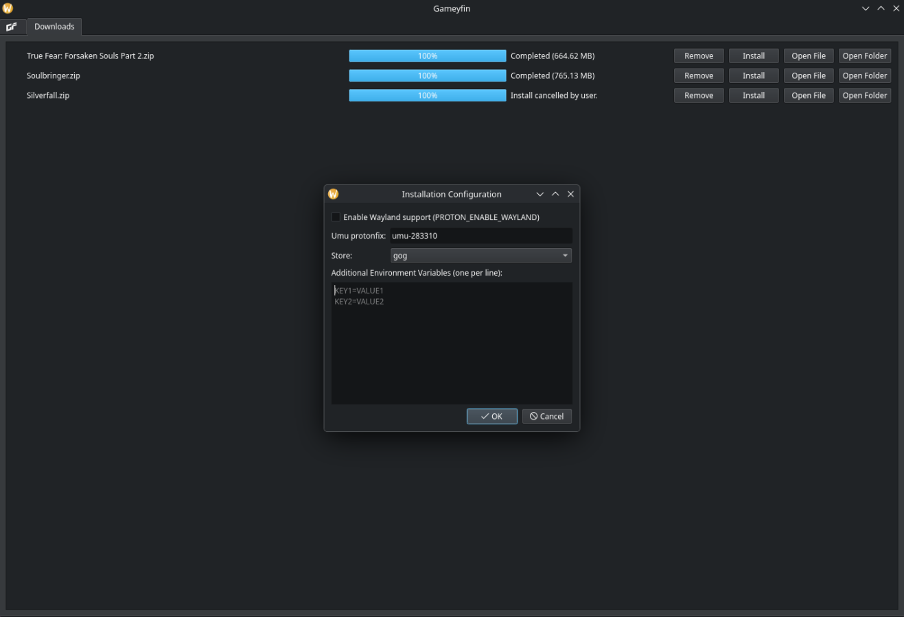
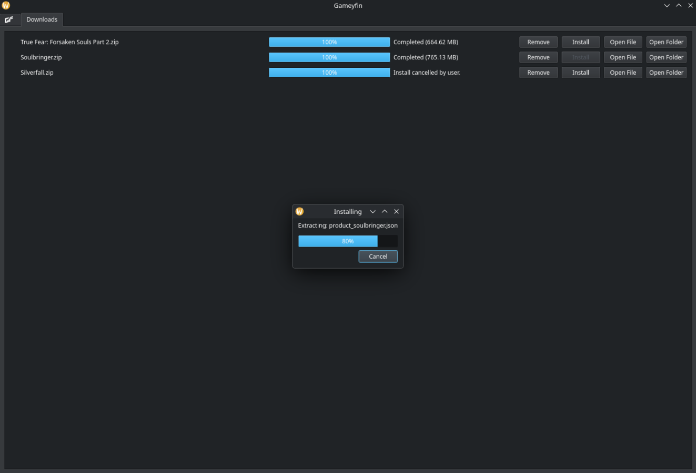
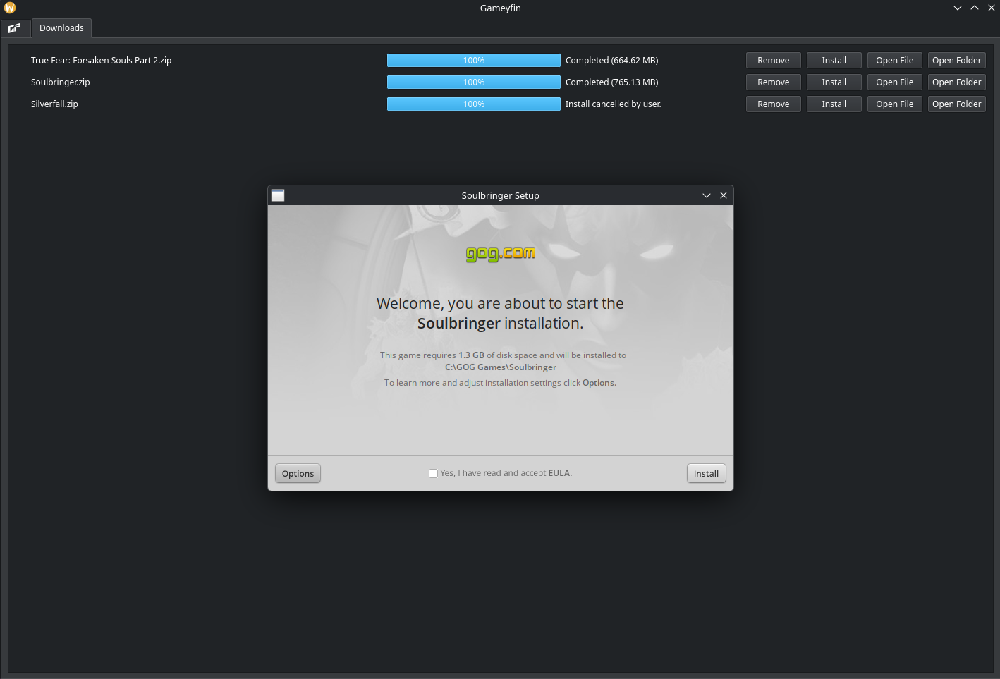
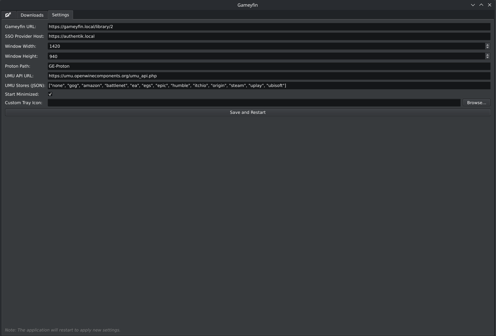

# 🖥️ Gameyfin Desktop

A dedicated desktop client for [Gameyfin](https://github.com/gameyfin/gameyfin) that wraps the web interface in a standalone application for a more integrated experience.

---
### ✨ Features

* **🖥️ Dedicated Desktop Application:** Runs Gameyfin in its own window, separate from your web browser.
* **🔑 Persistent SSO Login:** Supports persistent logins with SSO providers. The application saves your session data, so you only have to log in once. (*Note: This requires the "remember me" feature to be enabled in your SSO provider's settings.*)
* **⚙️ System Tray Integration:** Includes an icon in the system tray for quickly showing, hiding, or quitting the application.
* **⚙️ Integrated Settings:** Configure your Gameyfin URL, SSO host, window dimensions, and more directly within the app's **Settings** tab.
* **📥 Download Manager:**
  * Manages all file downloads in a persistent "Downloads" tab.
  * Shows progress, speed, and a complete download history.
* **💽 Installer (Linux):**
  * Prompts for per-install environment configuration (Wayland, GameID, Store, etc.).
  * Extracts the archive to its own folder.
  * Detects `.exe` files. If multiple are found, it asks you to choose which one to launch.
  * Automatically lookup the umu-id for proton fixes by codename, folder name or manual search entry.
  * Automatically creates a wineprefix and launches the installer using `umu-run`.
  * **🛠️ Wine Tools:** Quick access to `winecfg` and `winetricks` for manual prefix configuration during installation.
* **⤴️ Integrated Shortcut Management (Linux):**
  * When a game installation finishes, the app automatically detects any shortcuts created by the installer.
  * You're in Control: A dialog pops up letting you choose exactly which shortcuts (e.g., "Game" "Settings," "Uninstall") you want to add.
  * Dual-Location: Your selected shortcuts are placed on your **Desktop** and in your system's **Application Menu**.
  * Just like Windows: This gives you the simple, familiar "Create a desktop shortcut?" experience.
* **📦 Flatpak Support:** Ready to be built and run as a Flatpak for easy distribution and sandboxing.

### 🗓️ Planned Features
* **Windows support**
* **Other ideas?:** Create a new issue/merge request and I will look into it.

---
### 📋 Requirements

**Python Packages:**
* Python
* PyQt6
* PyQt6-WebEngine
* dotenv
* requests

You can install the required packages using one of the methods below.

#### Pip
```bash
pip install -r requirements.txt
```

#### Pacman
```bash
pacman -Syu python-pyqt6 python-pyqt6-webengine python-dotenv python-requests
```
---
**External Dependencies (for Installer):**
* **`umu-launcher`:** The installer feature on Linux **requires** `umu-launcher` to be installed.
#### Pacman
```bash
pacman -Syu umu-launcher
```
---
### 🛠️ Configuration

While the application can be configured using environment variables (see below), you can now manage most settings directly within the application's **Settings** tab. Settings saved in the app persist in a `settings.json` file.

| Environment Variable   | Description                                                                      |
|:-----------------------|:---------------------------------------------------------------------------------|
| `GF_URL`               | **(Required)** The URL of your Gameyfin instance, e.g., `http://localhost:8080`. |
| `GF_SSO_PROVIDER_HOST` | The host of your SSO provider, e.g., `sso.host.com`. **Required if using SSO.**  |
| `GF_START_MINIMIZED`   | Set to `1` to start the application minimized to the tray.                       |
| `GF_ICON_PATH`         | The absolute file path to a custom tray icon.                                    |
| `GF_WINDOW_WIDTH`      | Window width.                                                                    |
| `GF_WINDOW_HEIGHT`     | Window height.                                                                   |
| `PROTONPATH`           | Path or name of the Proton version to use (default: `GE-Proton`).                |
| `GF_UMU_API_URL`       | URL for the UMU API to search for game fixes.                                    |

---
### ▶️ How to Run

#### Standard Python
1. **Using a `.env` file or the Settings tab:**
   Create a `.env` file in the root directory (see `.env.example`) or configure it in the Settings tab after starting the app.
   ```bash
   python gameyfin_qt.py &
   ```

2. **Manual command:**
    ```bash
    GF_URL=http://192.168.1.100:8080 python gameyfin_qt.py &
    ```

#### Flatpak
You can build and install the application as a Flatpak:
```bash
# Build and install locally
flatpak-builder --user --install --force-clean build-dir org.gameyfin.GameyFinFrontend.yaml

# Run
flatpak run org.gameyfin.GameyFinFrontend
```

---
### 📝 Notes

#### Data Persistence
The application saves all browser data (cookies, local storage, cache, etc.) to a profile stored in a `.gameyfin-app-data` folder within the application's directory. This allows your login session to persist between launches. To clear your session and all stored data, simply delete this folder.

#### Download Progress
The download progress bar provides an estimation. The total size is calculated based on the uncompressed files within the archive, not the size of the `.zip` file being downloaded. See [this issue](https://github.com/gameyfin/gameyfin/issues/707#issuecomment-2038166299) for more details.

#### Installer
Currently only tested with GOG games, but should work with any installer.

### 🖼️ Screenshots







