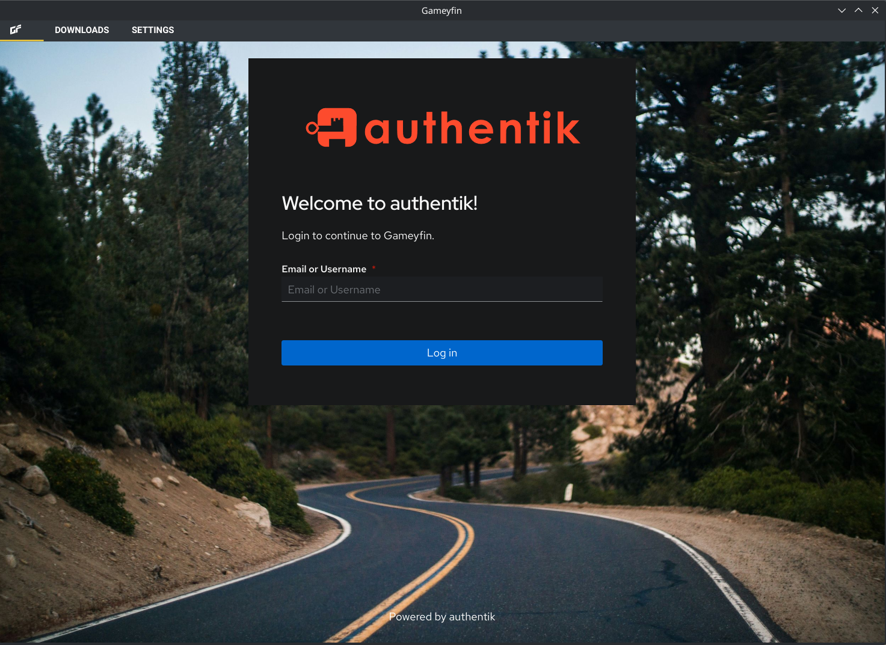
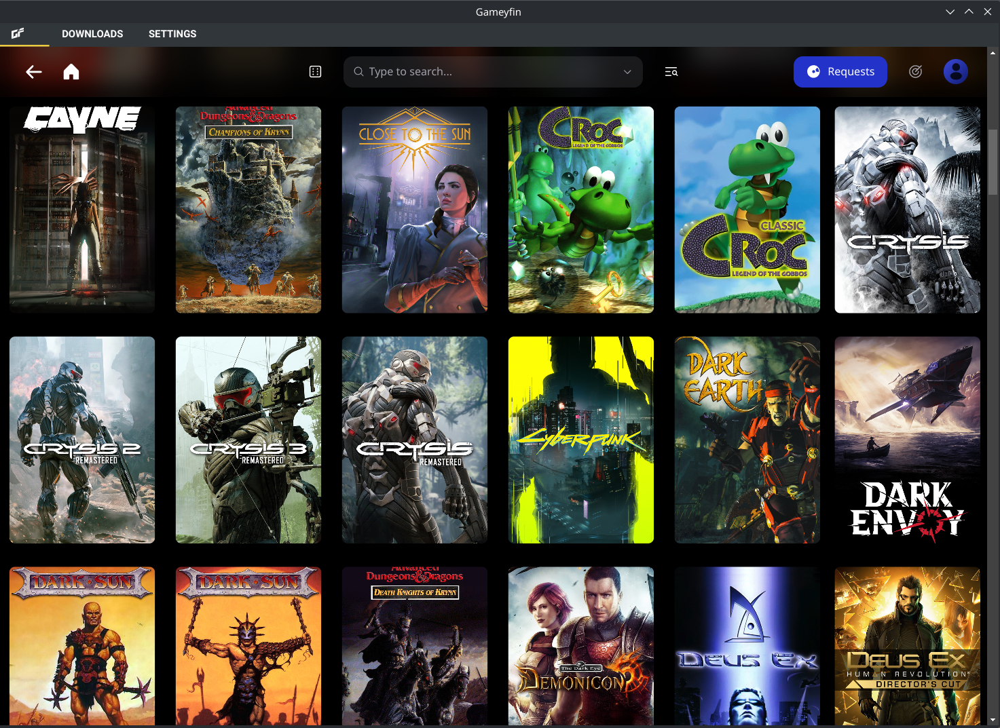
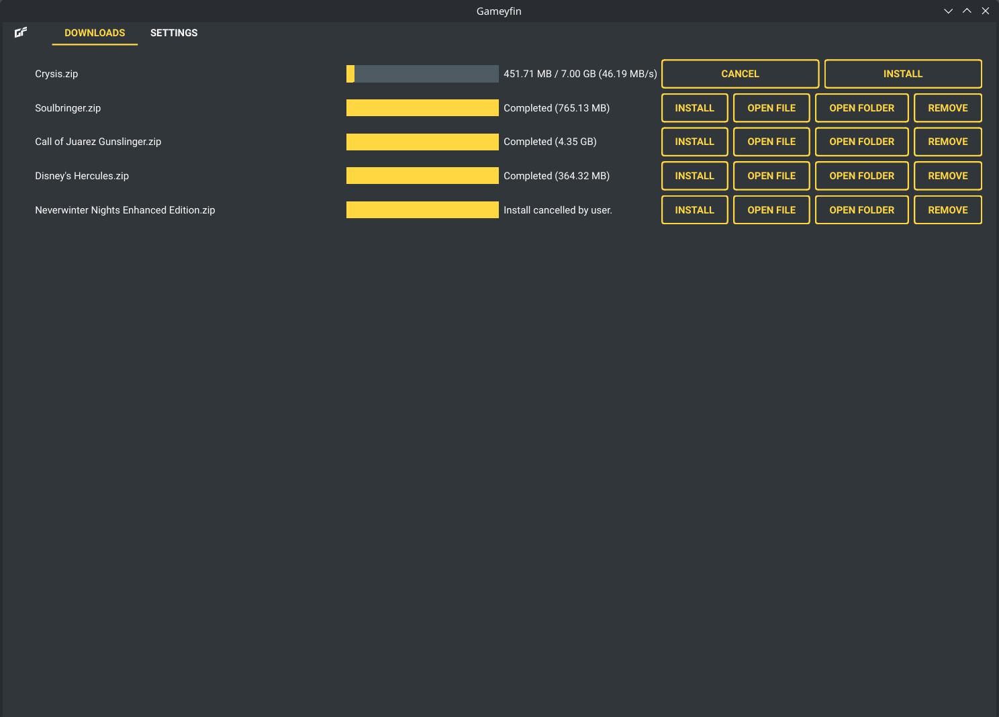
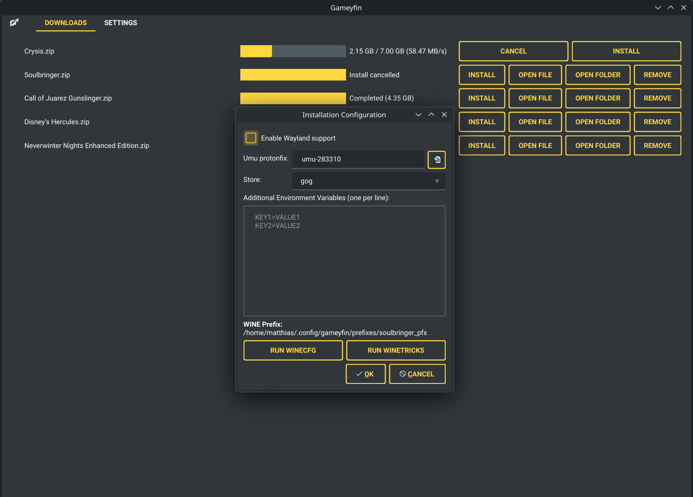
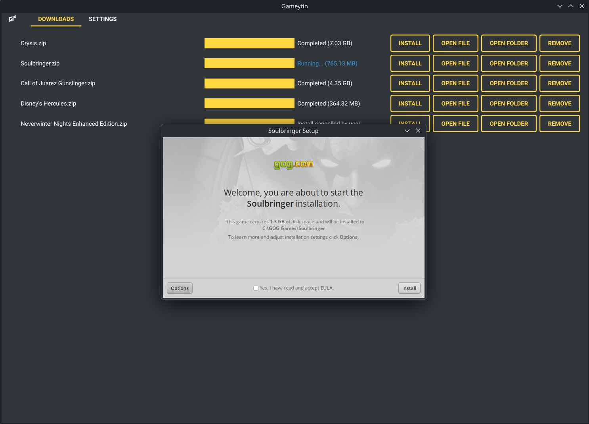
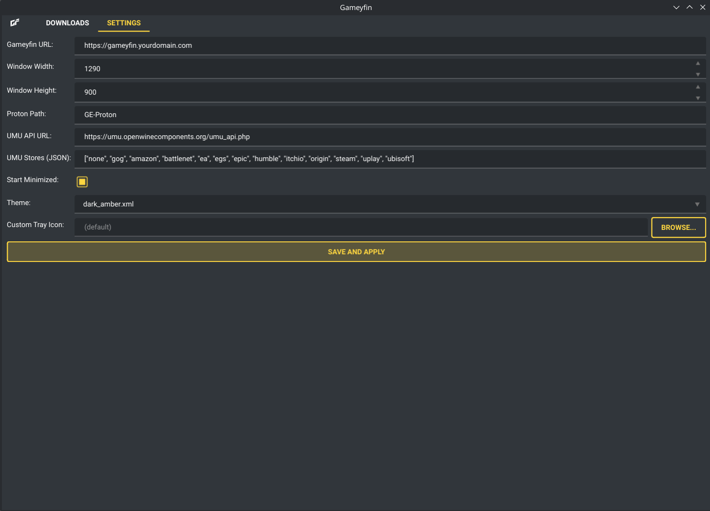

# 🖥️ Gameyfin Desktop

A dedicated desktop client for [Gameyfin](https://github.com/gameyfin/gameyfin) that wraps the web interface in a standalone application for a more integrated experience.

---
### ✨ Features

* **🖥️ Dedicated Desktop Application:** Runs Gameyfin in its own window on both Windows and Linux, separate from your web browser.
* **🔑 Persistent SSO Login:** Supports persistent logins with SSO providers. The application saves your session data, so you only have to log in once. (*Note: This requires the "remember me" feature to be enabled in your SSO provider's settings.*)
* **⚙️ System Tray Integration:** Includes an icon in the system tray for quickly showing, hiding, or quitting the application.
* **⚙️ Integrated Settings:** Configure your Gameyfin URL, window dimensions, and more directly within the app's **Settings** tab.
* **📥 Download Manager:**
  * Manages all file downloads in a persistent "Downloads" tab.
  * Shows progress, speed, and a complete download history.
* **⚡ Streaming Download & Extraction:**
  * Downloads and extracts ZIP archives simultaneously using `stream-unzip` — no intermediate ZIP file is ever saved to disk.
  * Saves disk space and skips the separate unzip step entirely.
  * Once the download completes, the **Install** button appears immediately.
* **💽 Installer (Windows):**
  * Extracts the downloaded archive.
  * Detects `.exe` files. If multiple are found, it asks you to choose which one to launch.
  * No complex configuration required.
* **💽 Installer (Linux):**
  * Prompts for per-install environment configuration (Wayland, MangoHud, GameID, Store, etc.).
  * Extracts the downloaded archive to a customizable directory.
  * Detects `.exe` files. If multiple are found, it asks you to choose which one to launch.
  * Automatically lookup the umu-id for proton fixes by codename, folder name or manual search entry.
  * Automatically creates a wineprefix and launches the installer using `umu-run`.
  * **🛠️ Wine Tools:** Quick access to `winecfg` and `winetricks` for manual prefix configuration during installation.
* **🍷 Prefix & Game Manager (Linux):**
  * **Quick Launch:** Launch any game shortcut script directly from the Prefix Manager via a select box.
  * **Post-Install Configuration:** Edit wine prefix settings (environment variables, Wayland, MangoHud, WOW64) after a game is installed.
  * **Shortcut Management:** Re-sync or clean up system shortcuts (Desktop & Application Menu) at any time.
  * **Prefix Cleanup:** Delete prefixes with a safety warning about saved game data.
* **⤴️ Integrated Shortcut Management (Linux):**
  * When a game installation finishes, the app automatically detects any shortcuts created by the installer.
  * **You're in Control:** A dialog pops up letting you choose exactly which shortcuts (e.g., "Game" "Settings," "Uninstall") you want to add.
  * **Dual-Location Selection:** Choose exactly which shortcuts you want on your **Desktop** and which should go in your **Application Menu** via a redesigned management dialog.
  * **Just like Windows:** This gives you the simple, familiar "Create a desktop shortcut?" experience.
  * **Auto-generated Helpers:** Even if system shortcuts aren't created, helper scripts are always generated for the internal launch menu.

### 🗓️ Planned Features
* **Other ideas?:** Create a new issue/merge request and I will look into it.

---

### 🛠️ Configuration

While the application can be configured using environment variables (see below), you can now manage most settings directly within the application's **Settings** tab. Settings saved in the app persist in a `settings.json` file.

| Environment Variable      | Description                                                                      |
|:--------------------------|:---------------------------------------------------------------------------------|
| `GF_URL`                  | **(Required)** The URL of your Gameyfin instance, e.g., `http://localhost:8080`. |
| `GF_START_MINIMIZED`      | Set to `1` to start the application minimized to the tray.                       |
| `GF_ICON_PATH`            | The absolute file path to a custom tray icon.                                    |
| `GF_WINDOW_WIDTH`         | Window width.                                                                    |
| `GF_WINDOW_HEIGHT`        | Window height.                                                                   |
| `GF_THEME`                | The UI theme to use (e.g., `dark_teal.xml`, `light_blue.xml`). Set to `auto` for default. |
| `PROTONPATH`              | **(Linux Only)** Path or name of the Proton version to use (default: `GE-Proton`).                |
| `GF_UMU_API_URL`          | **(Linux Only)** URL for the UMU API to search for game fixes.                                    |
| `GF_DEFAULT_DOWNLOAD_DIR` | Default directory where game archives are extracted (defaults to `~/Downloads`). |
| `GF_PROMPT_DOWNLOAD_DIR`  | Set to `1` to always prompt for a download directory when a download starts.     |

---

### ▶️ How to Run

Choose your platform below to get started.

#### 🪟 Windows

**Option 1: Executable (Recommended)**
1. Download the latest `Gameyfin-Desktop-vX.X.X.exe` from the [Releases](https://github.com/mdmatthias/Gameyfin-Desktop/releases) page.
2. Run the executable.

**Option 2: Running from Source (Python)**
1. **Install Python:** Ensure you have Python installed.
2. **Install Dependencies:**
   ```powershell
   py -m pip install -r requirements.txt
   ```
3. **Run the App:**
   ```powershell
   py gameyfin_qt.py
   ```

---

#### 🐧 Linux

**Option 1: Flatpak (Recommended)**
1. **Dependencies:** None required! The Flatpak build now includes the `umu-launcher` and all necessary dependencies.
2. **Install:** Download the latest `Gameyfin-Desktop-vX.X.X.flatpak` from the [Releases](https://github.com/mdmatthias/Gameyfin-Desktop/releases) page.

> **Note for SteamOS/Bazzite users:** You will need to use desktop mode to install games and add shortcuts to Steam to run them in Big Picture mode.
   Install it by running:
   ```bash
   flatpak install Gameyfin-Desktop-vX.X.X.flatpak
   ```
   Or with Discover:
   ```
      1. Remove the previous installed version if you are updating (settings will be kept) otherwise Discover will not be able to install the update.
      2. Open the new flatpak with Discover
      3. Install it.
   ```

3. **Run:** Launch it from your application menu or run:
   ```bash
   flatpak run org.gameyfin.Gameyfin-Desktop
   ```

**Option 2: Running from Source (Python)**
1. **Dependencies:** Install Python, required libraries, and `umu-launcher`.
   - stream-unzip is currently not available in the arch/fedora repo's, you will need to install it with pip with the --break-system-packages flag
   *   **Arch:**
       ```bash
       sudo pacman -Syu python-pyqt6 python-pyqt6-webengine python-dotenv python-requests python-qt-material umu-launcher
       pip install --user --break-system-packages stream-unzip
       ```
   *   **Fedora:**
       ```bash
       sudo dnf install python3-pyqt6 python3-pyqt6-webengine python3-dotenv python3-requests python3-qt-material umu-launcher
       pip install --user --break-system-packages stream-unzip
       ```
   *   **Pip (General):**
       ```bash
       pip install -r requirements.txt
       ```
2. **Run the App:**
   ```bash
   python gameyfin_qt.py &
   ```

---

### 📝 Notes

#### Data Persistence
The application saves all data (settings, download history, cookies, local storage, and cache) to your system's standard application data directory. This allows your login session and configuration to persist between launches.

*   **Linux:** `~/.local/share/Gameyfin/Gameyfin/`
*   **Windows:** `%APPDATA%\Gameyfin\Gameyfin\`


#### Download Progress
The download progress bar is based on the total size reported by the Gameyfin server. Since the server does not always send a `Content-Length` header, the size shown is estimated from the download button label in the UI. See [this issue](https://github.com/gameyfin/gameyfin/issues/707#issuecomment-2038166299) for more details.

### AI notice
Build with the help from Gemini,Claude,Gemma4. If you see something that could be better or looks weird, please let me know!

### 🖼️ Screenshots







