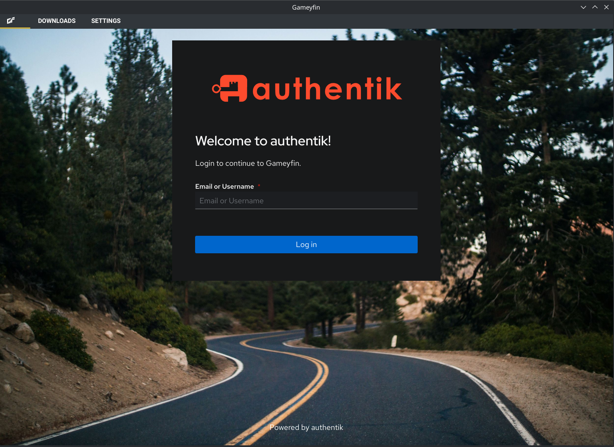
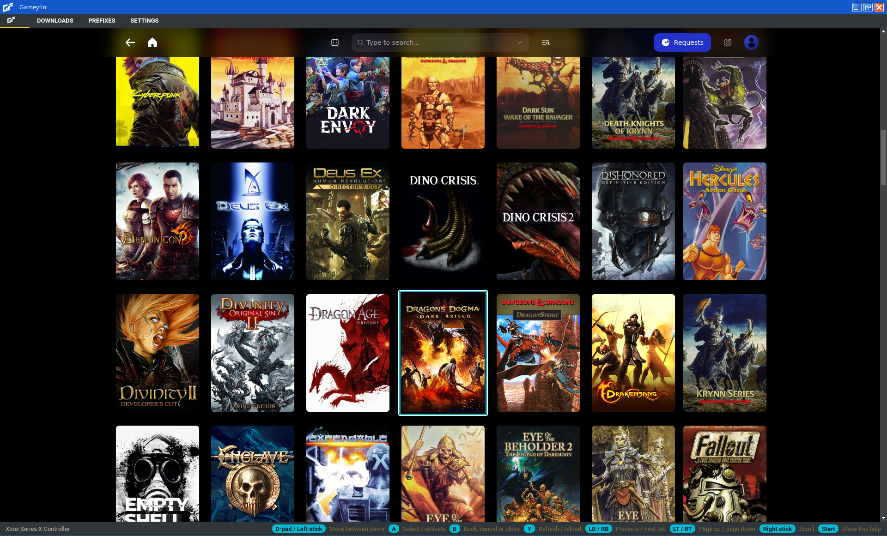
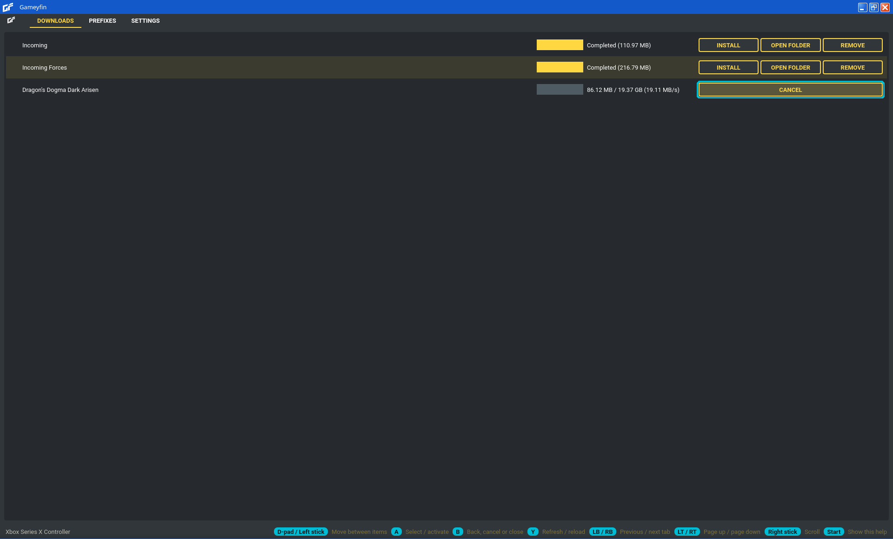
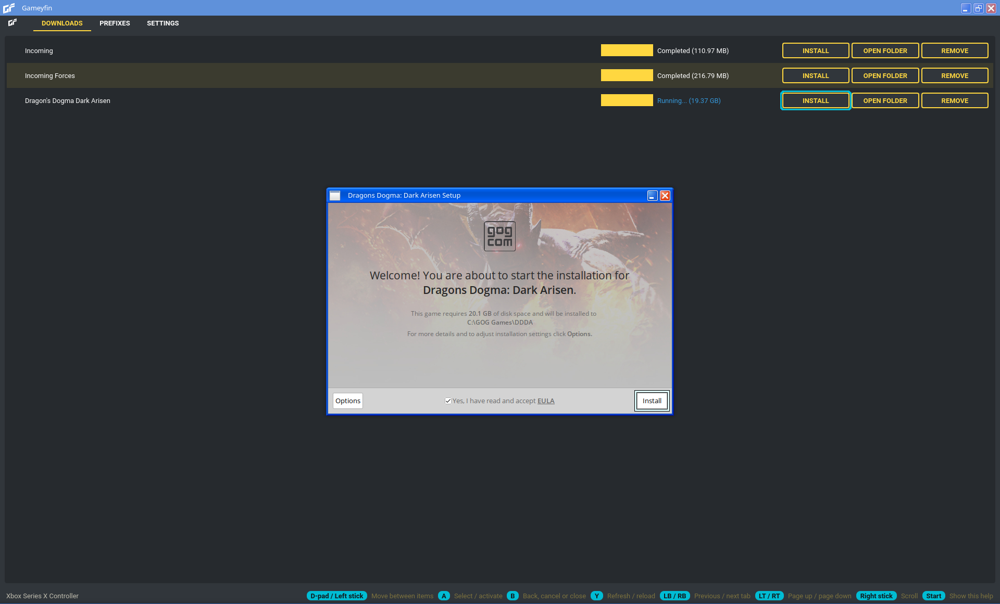
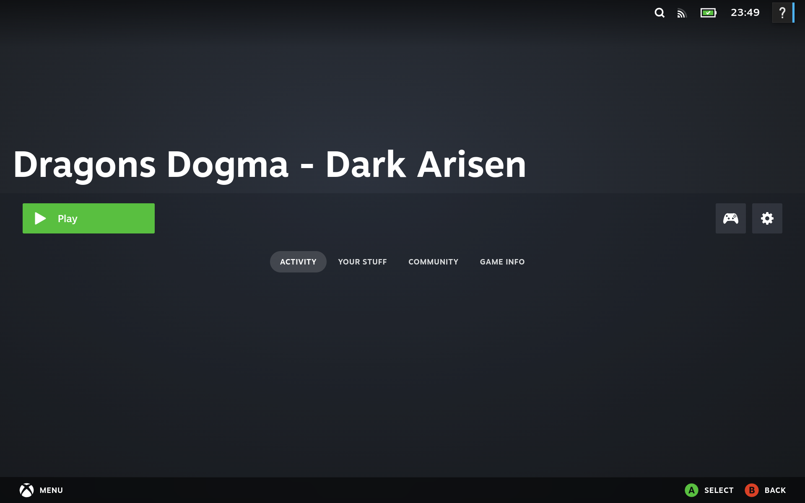

# 🖥️ Gameyfin Desktop

Download, install and play your games from [Gameyfin](https://github.com/gameyfin/gameyfin) — a desktop client for Windows and Linux.

---

### ✨ What it does

* **Download** games from your Gameyfin instance, with progress and history in a Downloads tab. Archives are extracted while they download, so nothing extra is written to disk.
* **Install** them with one click. On Linux the app creates a wine prefix and launches the installer with `umu-run` (including automatic umu-id lookup for Proton fixes); on Windows it just extracts and runs the `.exe`.
* **Play** them — shortcuts are created on your desktop, in your application menu and optionally in Steam, and installed games can be launched straight from the app. Wine prefixes can be reconfigured or deleted afterwards.
* **Couch friendly:** the whole app can be driven with a gamepad, and it lives in the system tray.
* Persistent login (including SSO) so you only sign in once.

<details>
<summary>Gamepad controls</summary>

| Button             | Action                    |
|:-------------------|:--------------------------|
| D-pad / Left stick | Move between items        |
| A                  | Select / activate         |
| B                  | Back, cancel or close     |
| Y                  | Refresh / reload          |
| LB / RB            | Previous / next tab       |
| LT / RT            | Page up / page down       |
| Right stick        | Scroll                    |
| Start              | Show the controls overlay |

</details>

---

### ▶️ Install & run

#### 🐧 Linux (Flatpak, recommended)

Download the latest `Gameyfin-Desktop-vX.X.X.flatpak` from [Releases](https://github.com/mdmatthias/Gameyfin-Desktop/releases), then:

```bash
flatpak install --user Gameyfin-Desktop-vX.X.X.flatpak -y
flatpak run org.gameyfin.Gameyfin-Desktop
```

Everything (including `umu-launcher`) is bundled, and no root password is needed.

#### 🪟 Windows

Download and run the latest `Gameyfin-Desktop-vX.X.X.exe` from [Releases](https://github.com/mdmatthias/Gameyfin-Desktop/releases).

#### From source

```bash
pip install -r requirements.txt
python gameyfin_qt.py
```

On Linux you also need `umu-launcher` from your distro's repos. If you prefer distro packages for the Python
dependencies, note that `stream-unzip` and `pygame-ce` (gamepad support) aren't packaged on Arch/Fedora and have to
come from pip.

On first launch, enter the URL of your Gameyfin instance in the **Settings** tab.

---

### 📝 Notes

* Data (settings, history, login session, cache) is stored in `~/.local/share/Gameyfin/Gameyfin/` on Linux and
  `%APPDATA%\Gameyfin\Gameyfin\` on Windows.
* Accurate download progress needs Gameyfin 2.4.1-preview or newer; on older servers the size is estimated.
* Ideas or bugs? Open an issue.
* Built with the help of AI — if something looks off, please let me know!

### 🖼️ Screenshots





