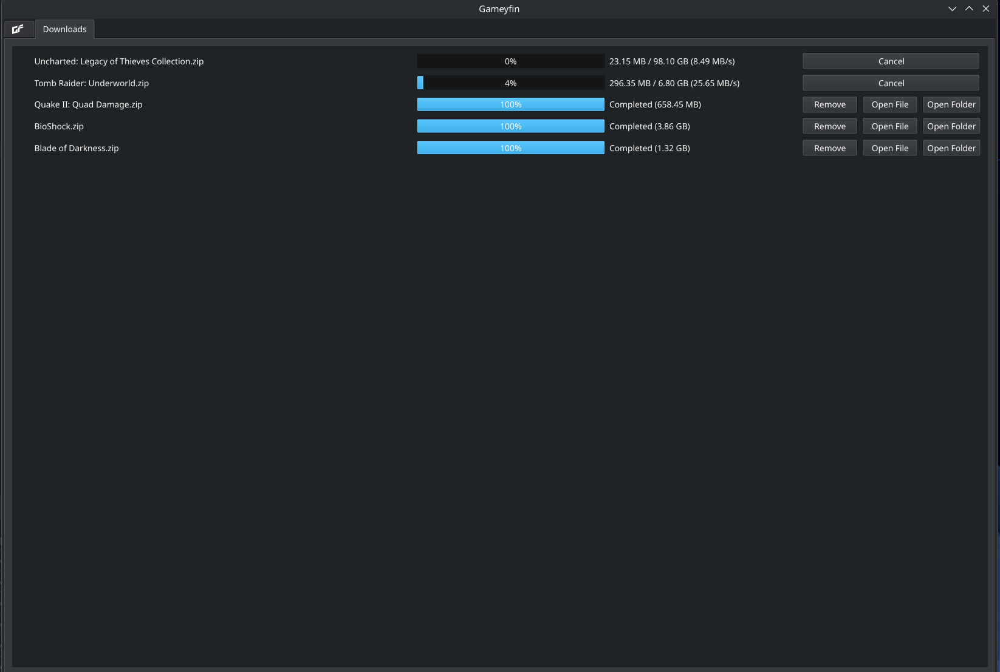

# 🖥️ Gameyfin Desktop

A dedicated desktop client for [Gameyfin](https://github.com/gameyfin/gameyfin) that wraps the web interface in a standalone application for a more integrated experience.




---
### ✨ Features

* **🖥️ Dedicated Desktop Application:** Runs Gameyfin in its own window, separate from your web browser.
* **🔑 Persistent SSO Login:** Supports persistent logins with SSO providers. The application saves your session data, so you only have to log in once. (*Note: This requires the "remember me" feature to be enabled in your SSO provider's settings.*)
* **⚙️ System Tray Integration:** Includes an icon in the system tray for quickly showing, hiding, or quitting the application.
* **📥 Integrated Downloader:** Handles file downloads with a native progress dialog.

---
### 🗓️ Planned Features

I'm planning to add more features in future updates, including:

* **Advanced Download Manager:** A dedicated panel to view and manage active and historical downloads.
* **Direct `umu-launcher` Integration (Linux):** An integration to install games directly from the Gameyfin interface using `umu-launcher`.

---
### 📋 Requirements

* Python
* PyQt6
* PyQt6-WebEngine
* dotenv 

You can install the required packages using one of the methods below.

#### Pip

```bash
pip install -r requirements.txt
```

#### Pacman
```bash
pacman -Syu python-pyqt6 python-pyqt6-webengine python-dotenv
```
---
### 🛠️ Configuration

The application is configured using environment variables. You can either pass them directly via the command line or create a `.env` file in the same directory as the script (see `.env.example`).

| Environment Variable | Description |
| :--- |:---|
| `GF_URL` | **(Required)** The URL of your Gameyfin instance, e.g., `http://localhost:8080`. |
| `GF_SSO_PROVIDER_HOST` | The host of your SSO provider, e.g., `sso.host.com`. **Required if using SSO.** |
| `GF_START_MINIMIZED` | Set to `1` to start the application minimized to the tray. Useful for autostarting on boot. |
| `GF_ICON_PATH` | The absolute file path to a custom tray icon, e.g., `/path/to/icon.png`. |

---
### ▶️ How to Run

* **Basic command:**
    ```
    GF_URL=[http://192.168.1.100:8080](http://192.168.1.100:8080) python gameyfin_qt.py &
    ```

* **With SSO enabled:**
    ```
    GF_URL=[http://192.168.1.100:8080](http://192.168.1.100:8080) GF_SSO_PROVIDER_HOST=sso.host.com python gameyfin_qt.py &
    ```

* **Using a `.env` file (Recommended):**
    Create a `.env` file in the root directory and add your variables there. Then, simply run:
    ```
    python gameyfin_qt.py &
    ```
---
### 📝 Notes

#### Data Persistence
The application saves all browser data (cookies, local storage, cache, etc.) to a profile stored in a `.gameyfin-app-data` folder within the application's directory. This allows your login session to persist between launches. To clear your session and all stored data, simply delete this folder.

#### Download Progress
The download progress bar provides an estimation. The total size is calculated based on the uncompressed files within the archive, not the size of the `.zip` file being downloaded. See [this issue](https://github.com/gameyfin/gameyfin/issues/707#issuecomment-2038166299) for more details.